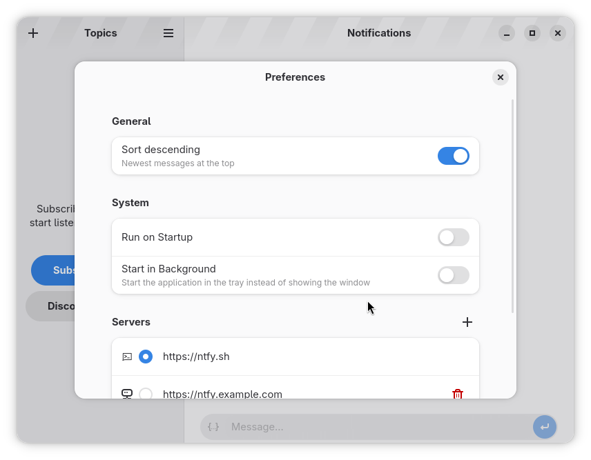

# Ntfyr

A native ntfy.sh client for the GNOME Desktop.

<div align="center">


<a href="https://flathub.org/en/apps/io.github.tobagin.Ntfyr"></a>
<a href="https://ko-fi.com/tobagin"></a>

</div>

## 🎉 Version 0.2.0 - Latest Release

**Ntfyr 0.2.0** brings new filtering capabilities and UI refinements for a smoother experience.

### ✨ Key Features

- **🚀 Native and Fast**: Built with Rust and GTK4 for a smooth, native experience.
- **📨 Push Notifications**: Instant notifications from ntfy.sh or self-hosted servers.
- **🔄 Background Service**: Runs reliably in the background via system portals.
- **📂 Attachments**: View images and download files directly within the app.
- **🧩 Multiple Servers**: Group subscriptions by server for better organization.
- **🛡️ Privacy Focused**: Full support for self-hosted instances.

### 🆕 What's New in 0.2.0

- **Filter Rules**: Create rules to filter notifications based on specific criteria.
- **Unified UI**: Consistent aesthetics across all dialogs (Add Server, Add Account, Add Topic).
- **Server Actions**: Improved menu for server management.
- **Muted Indicator**: Visual indicator for muted subscriptions.

For detailed release notes and version history, see [CHANGELOG.md](CHANGELOG.md).

## Features

### Core Features
- **Native Desktop Integration**: Uses GTK4 and Libadwaita for a perfect GNOME fit.
- **Unified Server Management**: Manage subscriptions from `ntfy.sh` and custom servers in one list.
- **Persistent Connection**: Daemonized backend ensures you never miss a notification.

### User Experience
- **Action Buttons**: Interact with notifications (Open Link, HTTP actions).
- **Shortcuts**: Keyboard shortcuts for quick navigation (`Ctrl+,`, `F1`, `Ctrl+N`).
- **System Tray**: Quick access and unread status indication.
- **Dark Mode**: Fully supports system-wide dark theme preference.

### Privacy & Customization
- **Self-Hosted Support**: Connect to your own ntfy server instances.
- **Local History**: Notifications are cached locally for offline viewing.
- **No Telemetry**: Your data stays on your machine.

## Building from Source

```bash
# Clone the repository
git clone https://github.com/tobagin/Ntfyr.git
cd Ntfyr

# Build and install development version
flatpak-builder --user --install --force-clean build packaging/io.github.tobagin.Ntfyr.Devel.yml
flatpak run io.github.tobagin.Ntfyr.Devel
```

## Usage

### Basic Usage

Launch Ntfyr from your applications menu or run:
```bash
flatpak run io.github.tobagin.Ntfyr
```

1.  Click the **+** button to add a subscription.
2.  Enter the topic component (e.g., `mytopic`).
3.  (Optional) Select or add a custom server.

### Sending Notifications

You can test Ntfyr using `curl`:

```bash
curl -d "Hello from CLI" ntfy.sh/mytopic
```

### Keyboard Shortcuts

- `Ctrl+,` - Open Preferences
- `Ctrl+Q` - Quit Application
- `F1` - Show Shortcuts Help
- `Ctrl+N` - Subscribe to new topic
- `Ctrl+F` - Search notifications

## Privacy & Security

Ntfyr is designated to respect your privacy:

- **Sandboxed**: Distributed as a Flatpak with strict permissions.
- **Local Data**: All history and configuration is stored locally.
- **Open Source**: Code is fully available for audit.

## Contributing

Contributions are welcome! Please see [CONTRIBUTING.md](CONTRIBUTING.md) for guidelines.

- Reporting Bugs: [GitHub Issues](https://github.com/tobagin/Ntfyr/issues)
- Discussions: [GitHub Discussions](https://github.com/tobagin/Ntfyr/discussions)

## License

Ntfyr is licensed under the [GPL-3.0-or-later](LICENSE).

## Acknowledgments

- **ntfy.sh**: For the amazing notification platform.
- **GNOME**: For the GTK toolkit.
- **Rust**: For the language.

## Screenshots

| Main Window | Topics View | Preferences |
|-------------|-------------|-------------|
|  |  |  |

---

**Ntfyr** - A native ntfy.sh client for the GNOME Desktop.

