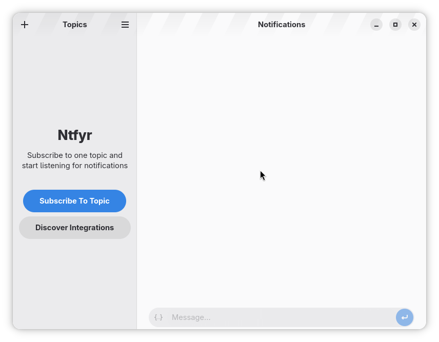
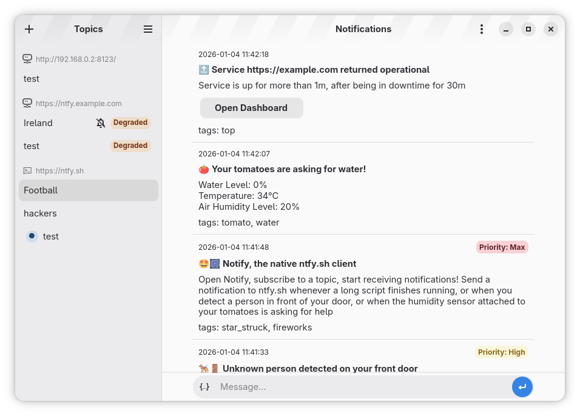
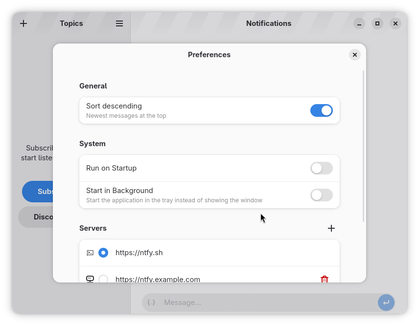

# Ntfyr

**Idiomas:** [English](README.md) · [Русский](README.ru.md) · [Deutsch](README.de.md) · [Español](README.es.md) · [Français](README.fr.md) · [Português](README.pt.md)

Cliente nativo de [ntfy.sh](https://ntfy.sh/) para o ambiente de trabalho GNOME. Desenvolvido em Rust, GTK4 e Libadwaita; distribuído como Flatpak.

<div align="center">



<a href="https://flathub.org/en/apps/io.github.tobagin.Ntfyr"></a>
<a href="https://ko-fi.com/tobagin"></a>

</div>

## Última versão: 0.6.1

Destaques recentes (histórico completo em [CHANGELOG.md](CHANGELOG.md)):

- **Selector de idioma da interface** — escolha o idioma nas Preferências (sistema, inglês US/UK, russo, alemão, espanhol, francês, português PT/BR); após reiniciar, as traduções aplicam-se a toda a aplicação.
- **Histórico ao subscrever** — novas subscrições carregam a cache do tópico no servidor sem reenviar mensagens apagadas nem inundar com alertas de secretária.
- **Modo em segundo plano fiável** — reativar a partir do lançador mostra sempre a janela; integração com a bandeja e portais melhorada no GNOME e KDE.
- **Self-hosted** — servidores privados HTTPS, IDs estáveis de notificações, limpeza atómica e fallbacks robustos do keyring quando o portal Secret não está disponível.
- **0.6.1** — versão de manutenção com dependências Rust atualizadas (GTK 0.22 / ashpd 0.13 / reqwest 0.13).

Instale a versão estável a partir do [Flathub](https://flathub.org/en/apps/io.github.tobagin.Ntfyr) ou compile a partir do código-fonte (abaixo).

## Funcionalidades

### Núcleo
- **Integração nativa** — GTK4 + Libadwaita, GNOME Platform 50.
- **Notificações push** — subscreva tópicos em `ntfy.sh` ou servidores auto-hospedados.
- **Daemon em segundo plano** — backend in-process mantém ligações SSE e entrega notificações de secretária.
- **Histórico local** — mensagens em SQLite para consulta offline e pesquisa.
- **Vários servidores** — subscrições agrupadas por servidor; ocultar ou mostrar a entrada `ntfy.sh` predefinida.

### Notificações e conteúdo
- **Encriptação ponta a ponta** — enviar e receber mensagens encriptadas.
- **Anexos** — ver imagens e transferir ficheiros na aplicação.
- **Botões de ação** — abrir ligações e executar ações HTTP a partir de notificações.
- **Filtros** — regras de filtragem por subscrição.

### Privacidade e segurança
- **Bloqueio da aplicação** — PIN/biometria opcional ao iniciar (via keyring do sistema).
- **Self-hosted** — ligar a instâncias ntfy privadas por HTTPS.
- **Flatpak isolado** — permissões restritas; sem telemetria.
- **Apenas dados locais** — definições e histórico permanecem no seu computador.

### Experiência de secretária
- **Bandeja do sistema** — acesso rápido e indicador de não lidos (ícone simbólico em painéis escuros).
- **Atalhos de teclado** — `Ctrl+N` novo tópico, `Ctrl+F` pesquisa, `Ctrl+,` preferências, `F1` ajuda.
- **Preferências** — formato de data/hora, arranque automático, lançamento em segundo plano, estado da janela.
- **Modo escuro** — segue o tema do sistema.

### Traduções

Interface disponível em inglês, russo, alemão, espanhol, francês e português (variantes europeia e brasileira na aplicação). Mais idiomas via gettext — consulte [CONTRIBUTING.md](CONTRIBUTING.md).

## Compilar a partir do código-fonte

Requer Flatpak, `flatpak-builder` e SDK/runtime GNOME 50 (instalados automaticamente pelo script a partir do Flathub).

```bash
git clone https://github.com/tobagin/Ntfyr.git
cd Ntfyr

# Produção (io.github.tobagin.Ntfyr)
./build.sh

# Desenvolvimento (io.github.tobagin.Ntfyr.Devel, perfil debug, hook pre-commit)
./build.sh --dev
```

Cada compilação instala-se no repositório Flatpak do utilizador `~/repo`. Executar:

```bash
flatpak run io.github.tobagin.Ntfyr          # production
flatpak run io.github.tobagin.Ntfyr.Devel    # development
```

Iteração rápida sem Flatpak (pacotes no sistema `gtk4-devel`, `libadwaita-devel` necessários):

```bash
cargo check   # verificação de tipos
cargo clippy  # lint
cargo run     # executar a partir do código-fonte
```

Arquitetura: [CLAUDE.md](CLAUDE.md); fluxo de desenvolvimento: [CONTRIBUTING.md](CONTRIBUTING.md).

## Utilização

Inicie o Ntfyr a partir do menu de aplicações ou execute:

```bash
flatpak run io.github.tobagin.Ntfyr
```

1. Clique em **+** para adicionar uma subscrição.
2. Introduza o nome do tópico (p. ex. `alerts`).
3. Opcionalmente escolha um servidor personalizado ou adicione um nas Preferências.

Enviar uma notificação de teste:

```bash
curl -d "Hello from CLI" ntfy.sh/mytopic
```

### Atalhos de teclado

| Atalho | Ação |
|--------|------|
| `Ctrl+N` | Subscrever novo tópico |
| `Ctrl+F` | Pesquisar notificações |
| `Ctrl+,` | Abrir Preferências |
| `Ctrl+Q` | Sair |
| `F1` | Mostrar atalhos de teclado |

## Contribuir

Contribuições são bem-vindas! Leia [CONTRIBUTING.md](CONTRIBUTING.md) antes de abrir um pull request.

- **Erros:** [GitHub Issues](https://github.com/tobagin/Ntfyr/issues)
- **Perguntas e ideias:** [GitHub Discussions](https://github.com/tobagin/Ntfyr/discussions)

## Licença

O Ntfyr está licenciado sob [GPL-3.0-or-later](LICENSE).

## Agradecimentos

- [ntfy.sh](https://ntfy.sh/) — a plataforma de notificações.
- [GNOME](https://www.gnome.org/) — GTK4 e Libadwaita.
- [Rust](https://www.rust-lang.org/) — implementação da aplicação e do daemon.

## Capturas de ecrã

| Janela principal | Tópicos | Preferências |
|------------------|---------|--------------|
|  |  |  |
